# PyVisualFields 

## A python tool collection for analyzing visual fields 

This packages includes functions for visuald field analysis and display. 

https://pypi.org/project/PyVisualFields/

Version 2 is R-independent while maintaining the original module organization. The modules are inspired by vfprogression (Elze et al. [1]) and visualFields (Marin-Franch et al. [2]). 
Additionally, pyGlaucoMetric has been integrated to enable glaucoma classification based on visual field patterns.

These functions are implemented in Python, and their functionalities are demonstrated across four primary categories:
-     Data Presentation
-     Plotting
-     Scoring and Progression Analysis
-     Normalization Analysis
-     Glaucoma Detection

For each category, we provide comprehensive Jupyter notebooks containing practical examples, detailed function descriptions, required inputs/dependencies, and expected outputs.

## Citation
If you found this package impactful for your research, please cite the following article: 
- PyVisualFields v2
- Mohammad Eslami, Saber Kazeminasab, Vishal Sharma, Yangjiani Li, Mojtaba Fazli, Mengyu Wang, Nazlee Zebardast, Tobias Elze; PyVisualFields: A Python Package for Visual Field Analysis. Trans. Vis. Sci. Tech. 2023;12(2):6. https://doi.org/10.1167/tvst.12.2.6.

and of course the corresponding sub-package:
- vfprogression (by Elze et al. [1])
- visualFields (by Marin-Granch et al. [2])
- pyGlaucoMetrics (by Moradi et al. [3])

## Installation: 

> pip install PyVisualFields

## Demo jupyter notebooks

The list and description of all functions are available at [All_Functions](#list-of-functions). They are all examined and introduced with examples in 4 different notebooks categorized:  
- Data [demo_1_Data.ipynb](demo_1_Data.ipynb)
- Normalization and deviation analysis [demo_2_Deviation_Analysis.ipynb](demo_2_Deviation_Analysis.ipynb)
- Plotting [demo_3_Plotting.ipynb](demo_3_Plotting.ipynb)
- Progression Analysis [demo_4_ProgressionAnalysis.ipynb](demo_4_ProgressionAnalysis.ipynb)
- Glaucoma Detection [demo5_PyGlaucoMetrics.ipynb](demo5_PyGlaucoMetrics.ipynb)  

__Notice:__ PyGlaucoMetric is also available as a seperatre PyPI package and GitHub repository (built upon PyVisualFields), which includes a graphical user interface (GUI) for progression analysis and glaucoma detection. Indeed PyVisualFields is designed as a developer-facing package library, while pyGlaucoMetric serves as an accessible GUI application implementing selected visual field analysis components.
https://github.com/Mousamoradi/PyGlaucoMetrics

## references:
[1] PyVisualFields v2
[2] Mohammad Eslami, Saber Kazeminasab, Vishal Sharma, Yangjiani Li, Mojtaba Fazli, Mengyu Wang, Nazlee Zebardast, Tobias Elze; PyVisualFields: A Python Package for Visual Field Analysis. Trans. Vis. Sci. Tech. 2023;12(2):6. https://doi.org/10.1167/tvst.12.2.6.
[3] https://cran.r-project.org/web/packages/vfprogression/index.html  
[4] https://cran.r-project.org/web/packages/visualFields/index.html  
[5] Moradi, Mousa, Saber Kazeminasab Hashemabad, Daniel M. Vu, Allison R. Soneru, Asahi Fujita, Mengyu Wang, Tobias Elze, Mohammad Eslami, and Nazlee Zebardast. 2025. "PyGlaucoMetrics: A Stacked Weight-Based Machine Learning Approach for Glaucoma Detection Using Visual Field Data" Medicina 61, no. 3: 541. https://doi.org/10.3390/medicina61030541 
 

## list of functions
The list and description of all functions are as follow. They are all examined and introduced with examples in 4 different notebooks. It is important to mention that, based on the background modules, the input VF dataframe needs to have columns with special column names. Make sure, to consider the data notebook. If further information is required, see the corresponding references: _vfprogression[1]_, _visualFields[2]_  
- Data [demo_1_Data.ipynb](demo_1_Data.ipynb)
- Normalization and deviation analysis [demo_2_Deviation_Analysis.ipynb](demo_2_Deviation_Analysis.ipynb)
- Plotting [demo_3_Plotting.ipynb](demo_3_Plotting.ipynb)
- Progression Analysis [demo_4_ProgressionAnalysis.ipynb](demo_4_ProgressionAnalysis.ipynb)
- Glaucoma Detection [demo5_PyGlaucoMetrics.ipynb](demo5_PyGlaucoMetrics.ipynb)
 

### Notice:
Version 2 has been validated exclusively for the 24-2 format. Additionally, the system assumes all visual field measurements are provided in right eye (OD) format.

Functions based on _vfprogression_ package accept 24-2 or 30-2 visual field measurement while functions based on _visualFields_ also accept 10-2. 

# Function Reference

<b>Data Utilities </b>

## Data Utilities

| Function | Description | Reference |
|----------|-------------|--------|
| `utils.canonicalize_vf_df()` | Canonicalize VF data to PyVisualFields format | PyVisualFieldsV2 |
| `utils.canonicalize_vf_df(, sort_byDateAge=True)` | Canonicalize and sort VFs by date/age within each patient | PyVisualFieldsV2 |
| `utils.print_vf_summary()` | Print a summary of available VF information | PyVisualFieldsV2 |
| `utils.investigate_vf_df()` | Return a summary of available VF information | PyVisualFieldsV2 |
| `utils.vf_blocks()` | Identify available VF blocks (`s`, `td`, `pd`, `tdp`, `pdp`) | PyVisualFieldsV2 |
| `utils.missing_blocks()` | Identify missing VF blocks | PyVisualFieldsV2 |
| `utils.compute_missing_blocks()` | Compute missing blocks using current normative setting NV | PyVisualFieldsV2 |

<b>Example Datasets</b>

## Example Datasets

| Function | Description | Reference |
|----------|-------------|--------|
| `visualFields.data_vfpwgRetest24d2()` | Humphrey 24-2 retest dataset | visualFields |
| `visualFields.data_vfctrSunyiu24d2()` | SUNY-IU control dataset | visualFields |
| `visualFields.data_vfpwgSunyiu24d2()` | SUNY-IU glaucoma dataset | visualFields |
| `visualFields.data_vfctrSunyiu10d2()` | SUNY-IU 10-2 control dataset | visualFields |
| `visualFields.data_vfctrIowaPC26()` | Iowa PC26 dataset | visualFields |
| `visualFields.data_vfctrIowaPeri()` | Iowa Peri dataset | visualFields |
| `vfprogression.data_vfseries()` | Longitudinal VF series dataset | vfprogression |
| `vfprogression.data_vfi()` | VFI dataset | vfprogression |
| `vfprogression.data_cigts()` | CIGTS dataset | vfprogression |
| `vfprogression.data_plrnouri2012()` |  | vfprogression |
| `vfprogression.data_schell2014()` |  | vfprogression |

<b>Deviation Analysis </b>

## Deviation Analysis

| Function | Description | Reference |
|----------|-------------|--------|
| `visualFields.getnv()` | Get current normative environment/setting | visualFields |
| `visualFields.setnv()` |  change/set normalization environment based on a predefined NV | visualFields |
| `visualFields.get_info_normvals()` | all avialbale predefined normalization environments/settings | visualFields |
| `visualFields.nvgenerate()` |generate a normalization environment based new data | visualFields |
| `utils.compute_missing_blocks()` | Compute missing blocks ( `td`, `pd`, `tdp`, `pdp`) using current normative setting NV | PyVisualFieldsV2 |
| `visualFields.gettd()` | compute td using current normative setting NV | visualFields |
| `visualFields.gettdp()` | compute tdp using current normative setting NV | visualFields |
| `visualFields.getpd()` | compute pd using current normative setting NV | visualFields |
| `visualFields.getpdp()` | compute pdp using current normative setting NV | visualFields |
| `visualFields.getgh()` | compute general heigh using current normative setting NV | visualFields |
| `visualFields.getgl()` | compute gl (global incices, e.g. msens (MS), tmd (i.e. MD, but weighted mean of TD values), pmd (i.e. weighted mean of PD values) psd, vfi, gh ) using current normative setting NV | visualFields |
| `visualFields.getglp()` | compute gl's probabilities (e.g. mdprob, psdprob) using current normative setting NV | visualFields |

<b>Progression Analysis </b>

## Progression Analysis 

| Function | Description |Reference |
|----------|-------------|--------|
| `vfprogression.get_score_AGIS()` | Compute AGIS score | vfprogression |
| `vfprogression.get_score_CIGTS()` | Compute CIGTS score | vfprogression |
| `vfprogression.progression_agis()` | AGIS progression analysis | vfprogression |
| `vfprogression.progression_cigts()` | CIGTS progression analysis | vfprogression |
| `vfprogression.progression_vfi()` | VFI progression analysis | vfprogression |
| `vfprogression.progression_plrnouri2012()` | Nouri et al. progression analysis | vfprogression |
| `vfprogression.progression_schell2014()` | Schell et al. progression analysis | vfprogression |
| `visualFields.glr()` | Linear regression with global indices | visualFields |
| `visualFields.plr()` | Pointwise linear regression (PLR) | visualFields |
| `visualFields.poplr()` | PoPLR regression analysis  | visualFields |

<b>Glaucoma Diagnostic</b>

## Glaucoma Diagnostic Criteria (PyGlaucoMetrics)

| Function | Description | Reference |
|----------|-------------|-----------|
| `PyGlaucoMetrics.Fn_HAP2()` | HAP2 glaucoma diagnosis | PyGlaucoMetrics[1,5] |
| `PyGlaucoMetrics.Fn_HAP2_part2()` | HAP2 severity classification | PyGlaucoMetrics[1,5] |
| `PyGlaucoMetrics.Fn_UKGTS()` | UKGTS criteria |PyGlaucoMetrics[1,5] |
| `PyGlaucoMetrics.Fn_LoGTS()` | LoGTS criteria |PyGlaucoMetrics[1,5] |
| `PyGlaucoMetrics.Fn_Foster()` | Foster criteria |PyGlaucoMetrics[1,5] |
| `PyGlaucoMetrics.Fn_Kangs()` | Kang's criteria |PyGlaucoMetrics[1,5] |

<b>Visualization Functions</b>

## Visualization

| Function | Description |
|----------|-------------|
| `vfprogression.plotValues()` | Plot sensitivity, TD, or PD values |
| `vfprogression.plotProbabilities()` | Plot TDP or PDP probability maps |
| `visualFields.vfplot()` | Generic VF plotting function |
| `visualFields.vfplot_s()` | Sensitivity plot |
| `visualFields.vfplot_td()` | Total deviation plot |
| `visualFields.vfplot_pd()` | Pattern deviation plot |
| `visualFields.vfplotsparklines()` | Sparkline visualization |
| `visualFields.vflegoplot()` | Lego plot visualization |
| `visualFields.plotProbColormap()` | Probability colormap legend |
| `visualFields.vfplotplr()` |  |
| `utils.Fn_report()` | Make a report of an eye | PyVisualFieldsV2 |

## Snapshots

[See Github Repository](https://github.com/mohaEs/PyVisualField)

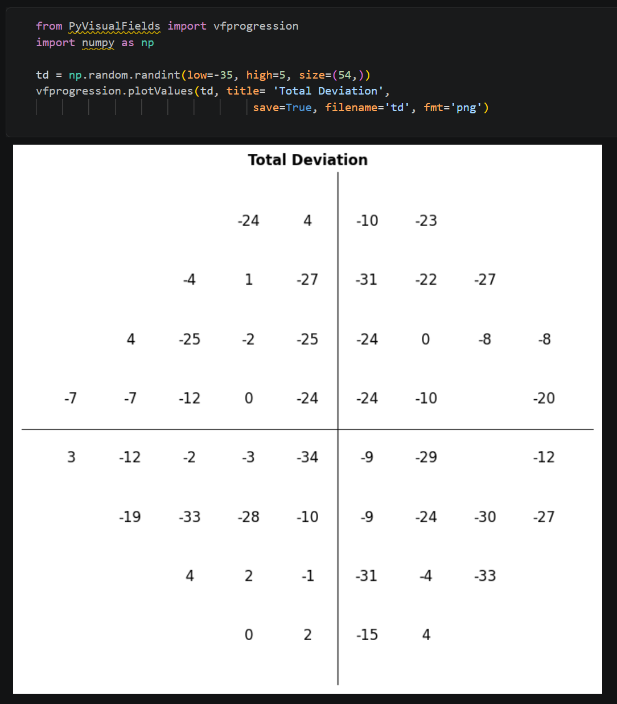
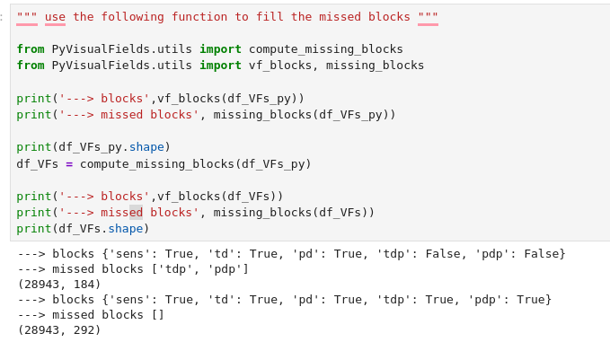
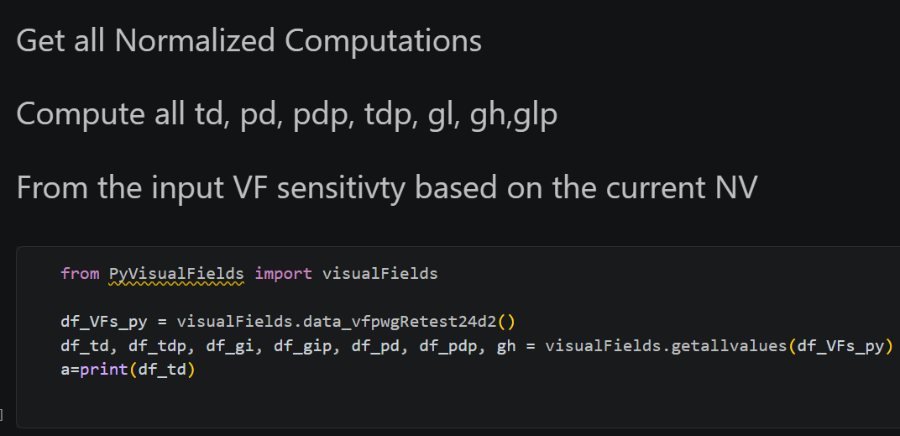
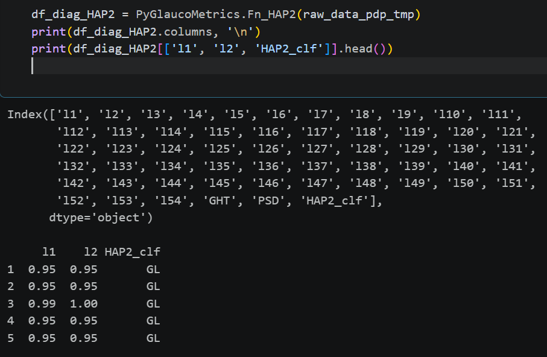
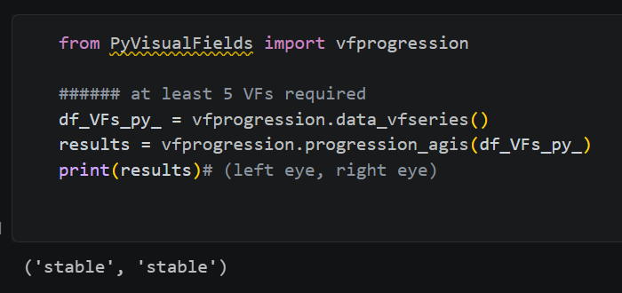
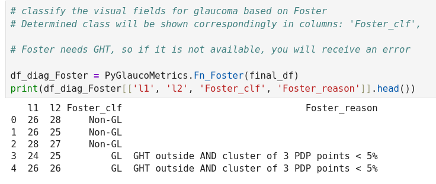
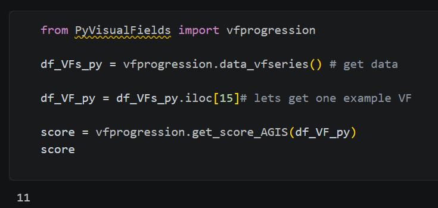
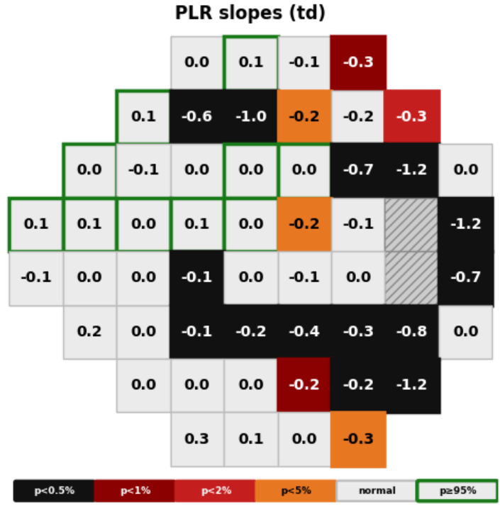
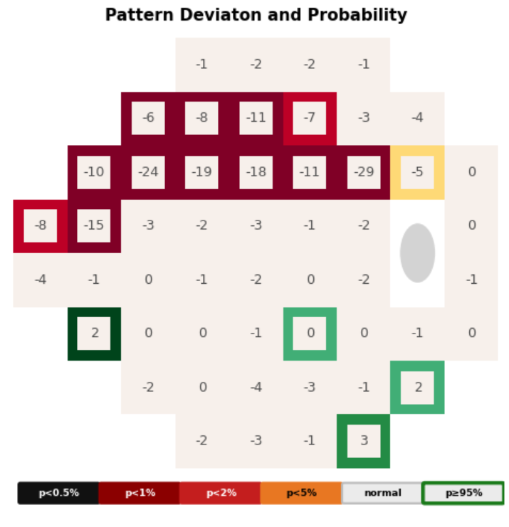
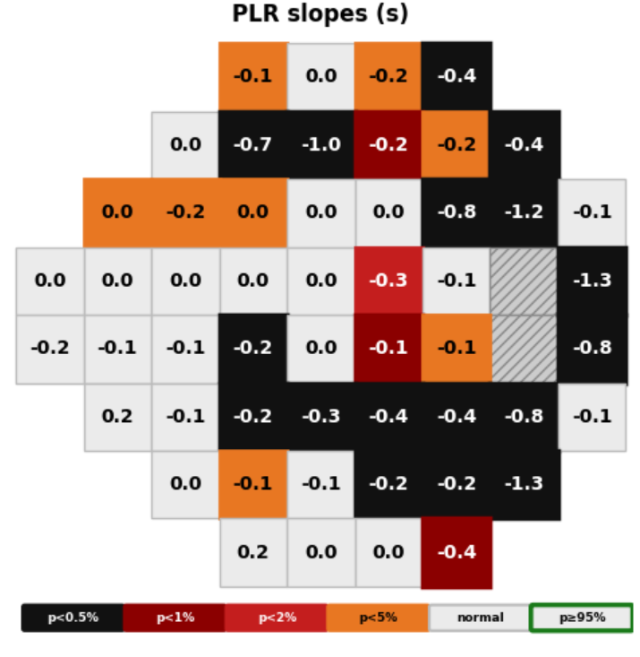
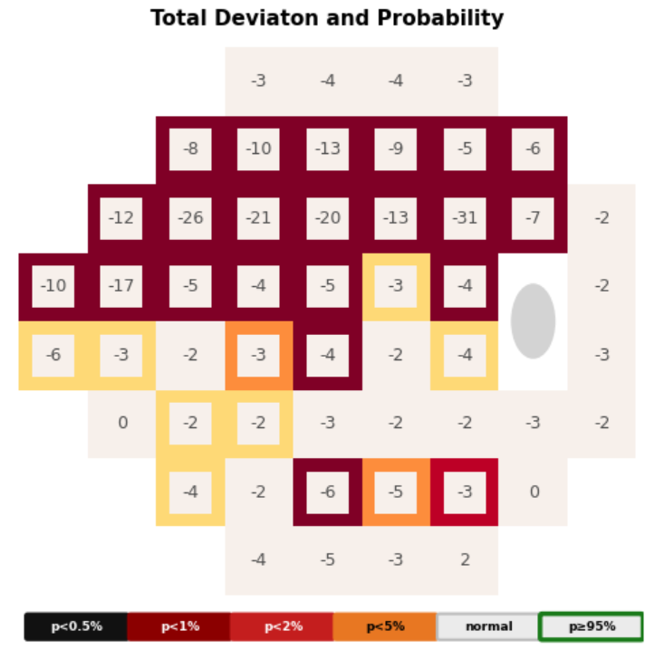
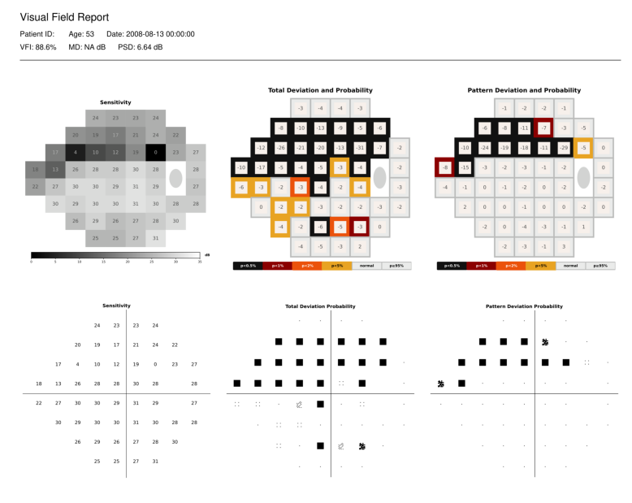
